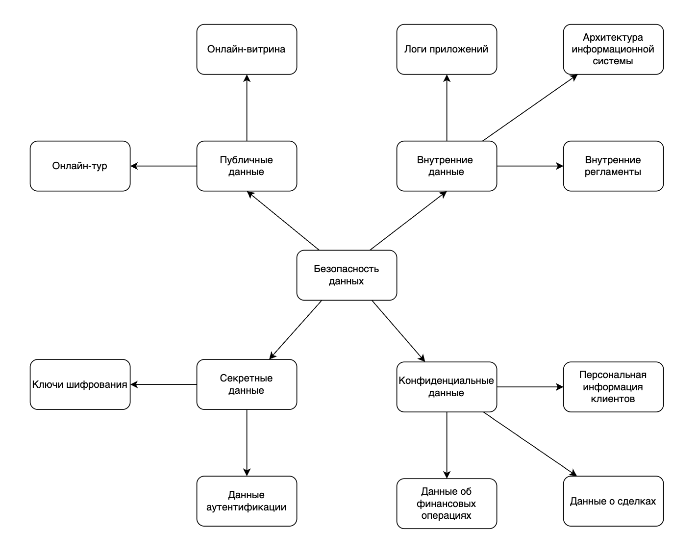

# Разработка проверочного листа по безопасности данных

## Публичные данные
### Утечка данных
Утечка публичных данных невозможна по определению, потому что это такая категория данных, которая подразумевает их расположение в публичной сети Интернет.
Риск **незначительный**.
### Потеря данных
Аналогично утечке.
Риск **незначительный**.
### Искажение данных
Искажение может негативно сказаться на репутации компании.
Риск **значительный**.
### Некачественные данные
Ошибки в данных для клиентов так же скажутся на репутации компании.
Риск **значительный**.
### Обесценивание данных
Часть информации теряет актуальность со временем.
Риск **незначительный**.

## Внутренние данные
### Утечка данных
Утечка данных позволит проанализировать работу компании конкурентами или любыми другими заинтересованными лицами.
Риск **значительный**.
### Потеря данных
Аналогично утечке.
Риск **значительный**.
### Искажение данных
Искажение данных может привести к принятию руководством компании неверных решений.
Риск **значительный**.
### Некачественные данные
Аналогично искажению данных.
Риск **значительный**.
### Обесценивание данных
Требуется регулярное обновление, т.к. без него данные теряют актуальность.
Риск **незначительный**.

## Kонфиденциальные данные
### Утечка данных
Утечка данных приведет к репутационным и, возможно, юридическим последствиям в связи с нарушением закона о персональных данных.
Риск **критический**.
### Потеря данных
Аналогично утечке данных.
Риск **критический**.
### Искажение данных
В случае искажения конфиденциальных данных могут быть нарушены различные процессы, например, подмена счета с которого производится оплата услуг.
Риск **значительный**.
### Некачественные данные
Аналогично искажению данных.
Риск **значительный**.
### Обесценивание данных
Потеря актуальности в данных может сказаться на процессах компании, например, приостановке проведения сделок с лицом, которое изменило персональные данные (сменило фамилию).
Риск **значительный**.

## Секретные данные
### Утечка данных
Утечка аутентификационных данных позволит получить несанкционированный доступ к секретным данным.
Риск **критический**.
### Потеря данных
Потеря аутентификационных данных позволит получить несанкционированный доступ к секретным данным.
Риск **критический**.
### Искажение данных
Подмена аутентификационных данных позволит получить несанкционированный доступ к секретным данным.
Риск **критический**.
### Некачественные данные
Некорректно сконфигурированные параметры безопасности могут привести к получению несанкционированного доступа.
Риск **критический**.
### Обесценивание данных
Несвоевременное обновление паролей и ключей шифрования имеет значительный риск.
Риск **значительный**.