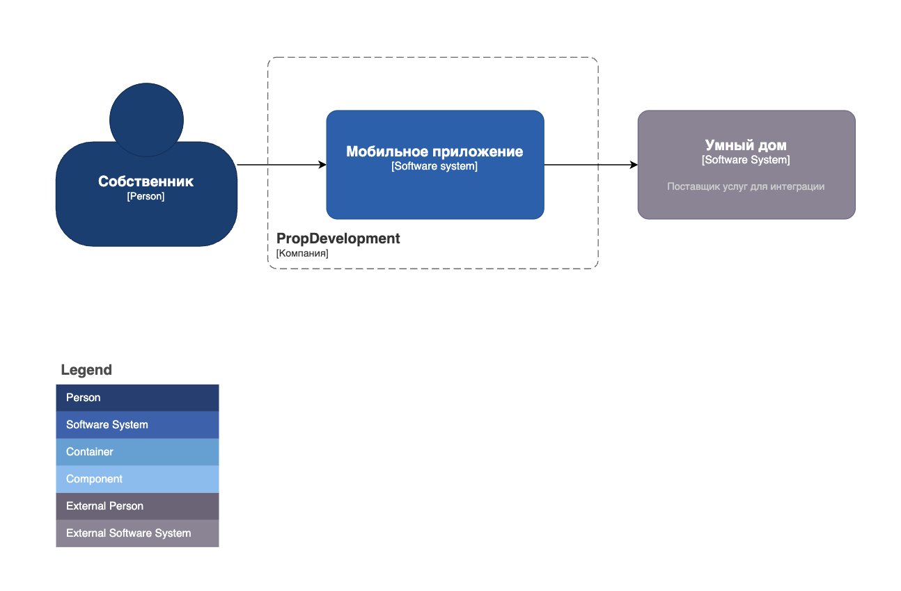
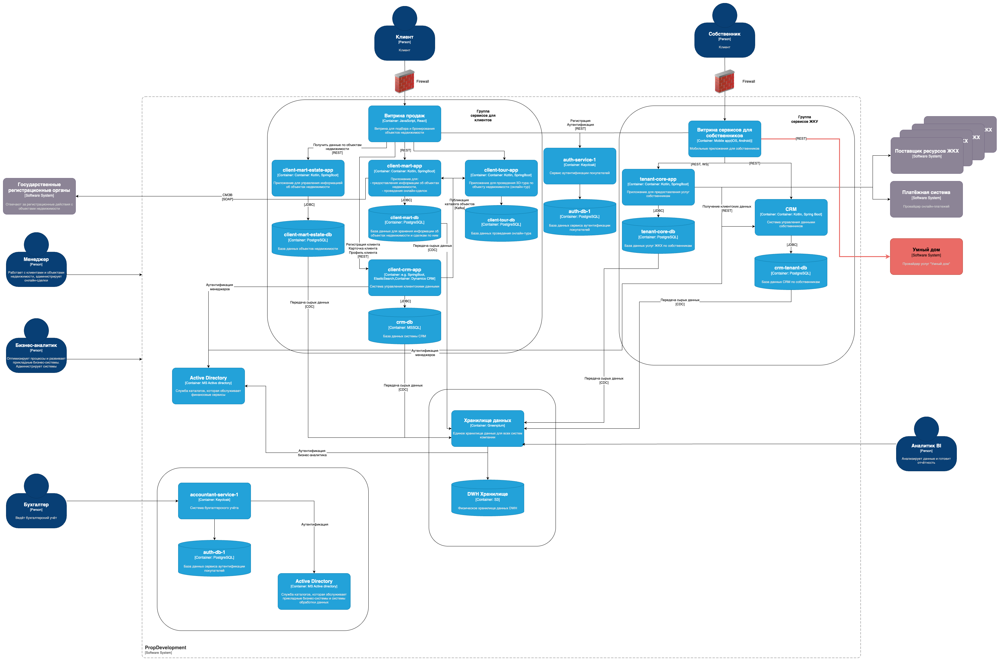

# Внешние интеграции
## Диаграмма контекста в модели С4

## Диаграмма контейнеров PropDevelopment

## Список требований, которым должны удовлетворить внешние интеграции
### Требования к безопасности
* HTTP over TLS (HTTPS) - для передачи трафика и исключения его перехвата; используются валидные сертификаты
* Чувствительные данные хранятся на стороне партнера исключая хранение на стороне PropDevelopment
* Осуществляется логирование и аудит всех запросов на интегрируемые операции (открыть домофон/шлагбаум)
### Протоколы аутентификации и авторизации
* Аутентификация будет осуществляться через протокол OAuth 2.0, который избавляет от необходимости доверять приложению логин и пароль, а также позволяет выдавать ограниченный набор прав, а не все сразу.
* RBAC/ABAC для управления устройствами
### Опишите, как будет организовано взаимодействие между системами предприятия и внешней платформой
Текущая схема взаимодействия предполагает прямую интеграцию услуг провайдера в мобильное приложение PropDevelopment.
Это позволяет не хранить персональные данные и/или биометрию пользователей, соответственно не проходить сертификацию.
Однако, это требует ответственного хранения на стороне провайдера и при заключении договора с ним необходимо убедится, что он соблюдает закон о персональных данных.

Пользователь, используя мобильное приложение, может внести персональные данные и/или биометрию в информационную систему провайдера, например, добавить номер своего автомобиля.

Устройства - шлагбаум и домофон - управляются провайдером. При обнаружении автомобиля выполняется распознавание его номера и происходит сверка внутри информационной системы провайдера на предмет наличия разрешения на въезд для этого номера автомобиля в указанный объект.
Аналогичным образом предполагается взаимодействие для другого устройства: домофон. Во время поступления звонка домофон его регистрирует и оповещает провайдера; провайдер выводит звонок на мобильное устройство пользователя с возможность открыть дверь или отклонить звонок.

В приведенных выше примерах, система предприятия никак не задействована, кроме как в части использования мобильного приложения.
Мобильное приложение же, в свою очередь, будет использовать вышеприведенные протоколы для аутентификации и авторизации, что позволит с достаточной надежностью обмениваться персональными данными и/или биометрией с провайдером услуг.